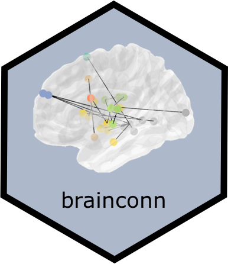

```{r, include = FALSE}
knitr::opts_chunk$set(
  collapse = TRUE,
  comment = "#>",
  fig.path = "man/img/README-",
  echo = TRUE,
  warning = FALSE,
  message = FALSE
)
library(magrittr)
if (!require("processx")) install.packages("processx")
devtools::load_all(".")
```


# brainconn   

<!-- badges: start -->
[](https://travis-ci.com/sidchop/brainconn)
[](https://ci.appveyor.com/project/sidchop/brainconn)
[](https://codecov.io/gh/sidchop/brainconn)
[](https://CRAN.R-project.org/package=brainconn)
[](https://www.tidyverse.org/lifecycle/#maturing)
<!-- badges: end -->


The purpose of this package is to allow for flexible, programmatic and interactive plotting of brain connectivity data within Rstudio - negating the need to swap to other visualization tools and allowing for reproducible integration of visualization with analysis scripts that are written in R. 

The primary plotting functions: `brainconn()` and `brainconn3D()`. The primary user input into these function is a connectivity matrix. Several brain atlases come pre-installed and users can also provide a custom atlas (see vignette).

The `brainconn()` function allows users to input a binary/weighted and directed/non-directed (i.e. symmetric) connectivity matrix which can be plotted onto MNI coordinates using [ggraph](https://github.com/ggraph).

The `brainconn3D()` allows users to input a binary and non-directed connectivity matrix which is plotted in a 3D and interactive way using [plottly](https://github.com/plotly).

The atlases currently included with in the package can be listed using the `list_atlases()` function: `aal116`, `aal90`, `craddock200`, `dk68`, `dk82_aspree`, `dkt62`, `gordon_333`, `shen_268`, `shen_368`, `schaefer1000_n7`, `schaefer1000_n17`, `schaefer300_n7`, `schaefer300_n17` (and all other iterations of the schaefer atlases). Custom atlases can be easily added as long as you have centroid coordinates in MNI space, see [vignette](https://sidchop.github.io/brainconn/articles/brainconn.html). The `check_atlas()` function checks that custom atlases meet the requirements of the plotting functions. 

## Installation
The package can be installed using devtools.

```{r eval=F}
install.packages("remotes")
remotes::install_github("sidchop/brainconn")
```

The functions are now installed, and you may load them when you want to use them.

## Use
The package also has a vignette, to help you get started. You can access it [here](https://sidchop.github.io/brainconn/articles/brainconn.html), or via R:

```{r, out.width='50%'}
library(brainconn)
vignette("brainconn")
```

The primary user input is a connectivity matrix (`conmat`). 

```{r, out.width='50%'}
brainconn(atlas ="schaefer300_n7", conmat=example_unweighted_undirected, view="ortho")
```

Modifiable features for `brainconn` include: `view`, `node.size`, `node.color`, `edge.width`, `edge.color`, `edge.alpha`, `background.alpha`, `labels` and others (see vignette)


```{r, results = 'hide', eval=F, echo=T, warning=F}
x <- example_unweighted_undirected
p <- brainconn3D(atlas ="schaefer300_n7", conmat=x, show.legend = F)
p
```

Included below is a gif of the interactive output (see [vignette](https://sidchop.github.io/brainconn/articles/brainconn.html) for more information): 

```{r, echo = FALSE,warning=F, error=F}
knitr::include_graphics("man/img/README-gif.gif")
```

Modifiable features for `brainconn3D` include: `node.size`, `node.color`, `edge.width`, `edge.color`, `adge.alpha`, `background.alpha`, `labels` and others (see [vignette](https://sidchop.github.io/brainconn/articles/brainconn.html))


### Report bugs or requests  
Don't hesitate to ask for support or new features using [github issues](https://github.com/sidchop/brainconn).

### Other R packages you might be intrested in:
* [ggseg](https://github.com/LCBC-UiO/ggseg) & [ggseg3D](https://github.com/LCBC-UiO/ggseg3d): Plotting tool for brain atlases, in ggplot/plotly
* [brainGraph](https://github.com/cwatson/brainGraph): Graph theory analysis of brain MRI data
* [fsbrain](https://github.com/dfsp-spirit/fsbrain): Provides high-level functions to access (read and write) and visualize surface-based brain morphometry data (e.g. cortical thickness) for individual subjects and groups.
* [NBR](https://github.com/zchuri/NBR/): Network Based R-statistics for Mixed Effects Models
* [fslr](https://github.com/muschellij2/fslr): FSL-R Interface package

### Citations
If you end up using `brainconn()` in a publication, please cite our paper, for which brainconn was created : Orchard, E. R., Chopra, S., Ward, P. G., Storey, E., Jamadar, S. D., & Egan, G. F. (2020). *Neuroprotective effects of motherhood on brain function in late-life: a resting state fMRI study.* Cerebral Cortex. \
https://pubmed.ncbi.nlm.nih.gov/33067999/


