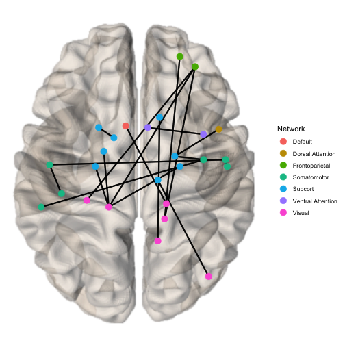
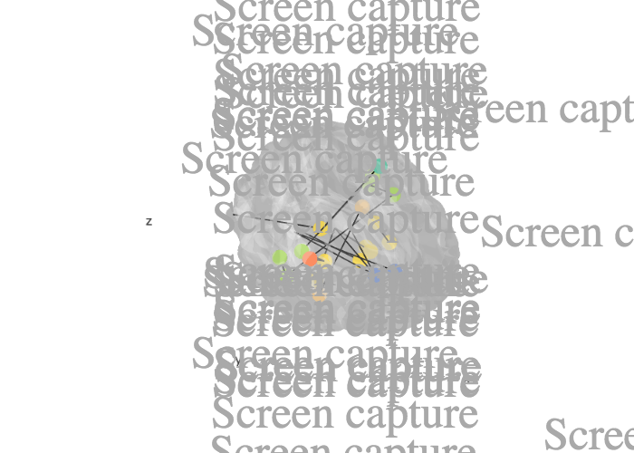

Plotting tool for brain connectivity data
================
Sidhant Chopra

brainconn 
===========================================================================

<!-- badges: start -->

<!-- badges: end -->

The purpose of this package is to allow for flexible, programmatic and
interactive plotting of brain connectivity data within Rstudio -
negating the need to swap to other visualization tools and allowing for
reproducible integration of visualization with analysis scripts that are
written in R.

The primary plotting functions: `brainconn()` and `brainconn3D()`. The
primary user input into these function is a connectivity matrix. Several
brain atlases come pre-installed and users can also provide a custom
atlas (see vignette).

The `brainconn()` function allows users to input a binary/weighted and
directed/non-directed (i.e. symmetric) connectivity matrix which can be
plotted according to MNI coordinates.

The `brainconn3D()` allows users to input a binary and non-directed
connectivity matrix which is plotted in a 3D and interactive way using
[plottly](https://github.com/plotly).

The atlases currently included with in the packaage can be listed using
the `list_atlases()` function: `aal116`, `aal90`, `craddock200`, `dk68`,
`dk82_aspree`, `dkt62`, `gordon_333`, `schaefer1000_n7`,
`schaefer300_17_cog_lang`, `schaefer300_n7`, `shen_268`, `shen_368`.
Custom atlases can be easily added as long as you have centroid
coordinates in MNI space, see vignette \[LINK\]. The `check_atlas()`
function checks that custom atlases meet the requirements of the
plotting functions.

Installation
------------

The package can be installed using devtools.

    install.packages("remotes")
    remotes::install_github("sidchop/brainconn", build_vignettes = TRUE)

The functions are now installed, and you may load them when you want to
use them.

Use
---

The package also has a vignette, to help you get started. You can access
it \[ADD GIT LINK\], or via R:

    library(brainconn)
    vignette("brainconn")
    #> starting httpd help server ... done

The primary user input is a connectivity matrix.

    x <- read.csv("data/example/example_unweighted_undirected.txt", header = F)

    brainconn(atlas ="schaefer300_n7", conmat=x)

Modifiable features for `brainconn` include: `view`, `node.size`,
`node.color`, `edge.width`, `edge.color`, `edge.alpha`,
`background.alpha`, `labels` and others (see vignette)

    x <- read.csv("data/example/example_unweighted_undirected.txt", header = F)
    p <- brainconn3D(atlas ="Stages_melbBrain", conmat=x, show.legend = F)
    p

Included below is a screenshot of the interactive output:

Modifiable features for `brainconn3D` include: `node.size`,
`node.color`, `edge.width`, `edge.color`, `adge.alpha`,
`background.alpha`, `labels` and others (see vignette)

### Report bugs or requests

Don’t hesitate to ask for support using [github
issues](https://github.com/sidchop/brainconn), Please feek free to add
and errors or feature reques through the issues.
